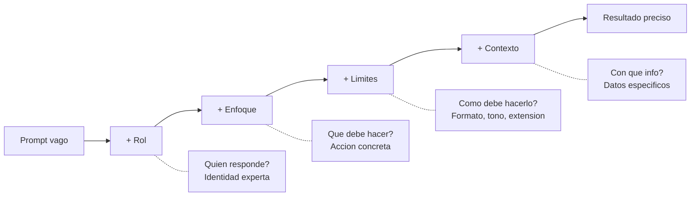
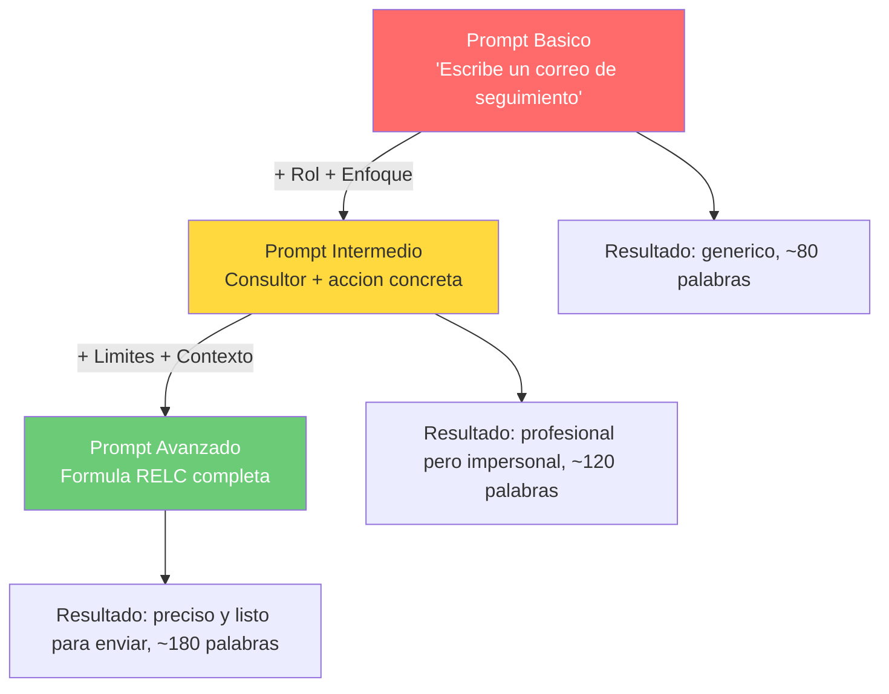

# Reto 12 — Prompt Engineering Implementation Plan

> **For agentic workers:** REQUIRED SUB-SKILL: Use superpowers:subagent-driven-development (recommended) or superpowers:executing-plans to implement this plan task-by-task. Steps use checkbox (`- [ ]`) syntax for tracking.

**Goal:** Create a comprehensive README.md demonstrating the Rol + Enfoque + Limites + Contexto prompt engineering methodology through 3 progressive email-writing prompts.

**Architecture:** Single Markdown file with 11 sections, 2 Mermaid diagrams, simulated LLM results, and comparative analysis tables. No code, no dependencies.

**Tech Stack:** Markdown, Mermaid diagrams

**Spec:** `docs/superpowers/specs/2026-03-24-reto-12-prompt-engineering-design.md`

---

### Task 1: Header + El reto + La metodologia

**Files:**
- Create: `reto-12/README.md`

- [ ] **Step 1: Write sections 1-3**

Write the README with:

**Section 1 — Header:**
```markdown
# Reto 12 — Prompt Engineering: De generico a preciso

> Vibe Coders League Platzi 2026

Elige un objetivo y escribe 3 versiones de prompts (basico, intermedio, avanzado). Muestra los resultados y explica que tecnicas usaste para mejorar.

**Estado:** Completado
```

**Section 2 — El reto:**
- What the challenge asks for (3 prompt versions, show results, explain techniques)
- The 5 techniques to demonstrate: contexto, ejemplos, formato, rol, restricciones

**Section 3 — La metodologia:**
- Explain the RELC formula (Rol + Enfoque + Limites + Contexto)
- Brief description of each component:
  - Rol: who responds (expert identity)
  - Enfoque: what to do (concrete action with action verbs)
  - Limites: how to do it (format, tone, length)
  - Contexto: with what info (substance and reference)
- Mermaid diagram showing the 4 components and their relationship:



- Mapping table: challenge techniques (5) → RELC components (4), explaining where "ejemplos" fits

- [ ] **Step 2: Commit**

```bash
git add reto-12/README.md
git commit -m "feat(reto-12): add header, challenge description, and methodology"
```

---

### Task 2: El objetivo elegido + Prompt Basico

**Files:**
- Modify: `reto-12/README.md`

- [ ] **Step 1: Write sections 4-5**

**Section 4 — El objetivo elegido:**
- Task: write a professional follow-up email after a business meeting
- Scenario: consultant in digital transformation had a meeting with Carlos Mendez (Dir. Operations at ManufacturaPro) about digitizing their production line. Interest in a 3-month pilot phase.

**Section 5 — Prompt Basico:**

Prompt (one generic line):
```
Escribe un correo de seguimiento despues de una reunion
```

Simulated result (~80 words):
- Generic greeting ("Estimado/a")
- Vague reference to "nuestra reunion reciente"
- No names, no specific data
- No concrete next steps
- Flat, formulaic tone

Analysis table:

| Elemento | Presente? | Detalle |
|----------|-----------|---------|
| Rol      | No        | No se asigna identidad |
| Enfoque  | Implicito | Solo dice "escribe un correo" |
| Limites  | No        | Sin formato, tono ni extension |
| Contexto | No        | Sin datos de la reunion |

Verdict: explain why the result is generic — the model has no constraints, no identity, no information to work with.

- [ ] **Step 2: Commit**

```bash
git add reto-12/README.md
git commit -m "feat(reto-12): add objective and basic prompt with analysis"
```

---

### Task 3: Prompt Intermedio

**Files:**
- Modify: `reto-12/README.md`

- [ ] **Step 1: Write section 6**

**Section 6 — Prompt Intermedio:**

Prompt (adds Rol + Enfoque):
```
Eres un consultor de transformacion digital. Redacta un correo de seguimiento
profesional despues de una reunion con un potencial cliente empresarial.
El correo debe transmitir profesionalismo y mantener el interes del cliente.
```

Simulated result (~120 words):
- More professional and consultative tone
- Mentions "transformacion digital" as the topic
- References being a consultant
- Still no proper names or meeting details
- Generic next steps ("quedo a su disposicion")

Analysis table:

| Elemento | Presente? | Detalle |
|----------|-----------|---------|
| Rol      | Si        | Consultor de transformacion digital |
| Enfoque  | Si        | Redactar follow-up profesional |
| Limites  | No        | Sin restricciones de formato/extension |
| Contexto | No        | Sin datos especificos |

Verdict: the role gives professional tone and the focus sharpens the action, but without limits and context the email remains impersonal and not actionable.

- [ ] **Step 2: Commit**

```bash
git add reto-12/README.md
git commit -m "feat(reto-12): add intermediate prompt with analysis"
```

---

### Task 4: Prompt Avanzado

**Files:**
- Modify: `reto-12/README.md`

- [ ] **Step 1: Write section 7**

**Section 7 — Prompt Avanzado:**

Prompt (full RELC formula):
```
[ROL] Eres un consultor senior de transformacion digital con 10 anios de
experiencia en el sector manufacturero.

[ENFOQUE] Redacta un correo de seguimiento despues de una reunion de negocios
con un potencial cliente.

[LIMITES]
- Maximo 200 palabras
- Tono profesional pero cercano
- Incluye un CTA (call to action) claro
- Estructura: saludo > agradecimiento > resumen de lo discutido > proximos pasos > cierre
- No uses jerga tecnica excesiva

[CONTEXTO]
- Reunion con Carlos Mendez, Director de Operaciones de ManufacturaPro
- Se discutio la digitalizacion de su linea de produccion
- Mostro interes en una fase piloto de 3 meses
- El proximo paso es enviar una propuesta formal esta semana
- La reunion fue en las oficinas de ManufacturaPro y el ambiente fue positivo
```

Simulated result (~150-200 words):
- Uses "Carlos" and "ManufacturaPro" by name
- Specific reference to production line digitization
- Mentions the 3-month pilot phase
- Clear CTA: "enviare la propuesta formal el miercoles"
- Structure: greeting > thanks > discussion summary > next steps > closing
- Professional but warm tone
- Within 200 words

Analysis table:

| Elemento | Presente? | Detalle |
|----------|-----------|---------|
| Rol      | Si        | Consultor senior, 10 anios, sector manufacturero |
| Enfoque  | Si        | Correo de follow-up post-reunion |
| Limites  | Si        | 200 palabras, tono, CTA, estructura, sin jerga |
| Contexto | Si        | Carlos Mendez, ManufacturaPro, piloto 3 meses, propuesta |

Verdict: with the full formula, the model produces a ready-to-send email. Each element contributed: Rol gave expertise and tone, Enfoque defined the action, Limites shaped the format, Contexto provided the substance.

- [ ] **Step 2: Commit**

```bash
git add reto-12/README.md
git commit -m "feat(reto-12): add advanced prompt with full RELC formula"
```

---

### Task 5: Comparativa + Diagrama de evolucion

**Files:**
- Modify: `reto-12/README.md`

- [ ] **Step 1: Write sections 8-9**

**Section 8 — Comparativa general:**

Summary table:

| Nivel | Rol | Enfoque | Limites | Contexto | Calidad |
|-------|-----|---------|---------|----------|---------|
| Basico | — | Implicito | — | — | Generico, no usable |
| Intermedio | Consultor | Follow-up profesional | — | — | Profesional pero impersonal |
| Avanzado | Consultor senior, 10a exp. | Follow-up post-reunion | 200 palabras, tono, CTA, estructura | Carlos, ManufacturaPro, piloto | Preciso, personalizado, listo para enviar |

**Section 9 — Diagrama de evolucion:**

Mermaid flowchart showing the 3 levels mapped to the formula:



Each node shows what was added and the resulting quality level. Color-coded: red (basic) > yellow (intermediate) > green (advanced).

- [ ] **Step 2: Commit**

```bash
git add reto-12/README.md
git commit -m "feat(reto-12): add comparison table and evolution diagram"
```

---

### Task 6: Tips adicionales + Conclusiones

**Files:**
- Modify: `reto-12/README.md`

- [ ] **Step 1: Write sections 10-11**

**Section 10 — Tips adicionales:**

4 practical tips:
1. **Divide problemas complejos en pasos:** if you need multiple outputs (email + proposal + presentation), write a specific prompt for each step instead of one mega-prompt.
2. **Creatividad vs. precision:** for creative tasks (brainstorming, copy), give more freedom. For precise tasks (emails, code), add more limits.
3. **Elige modelo y enfoque segun la tarea:** different tasks benefit from different approaches — summarization needs precision, ideation needs creativity.
4. **Ejemplos (few-shot):** when to include examples in the prompt. In this case, specific context was more valuable than generic email examples — but for tasks like classification or formatting, few-shot examples are very powerful.

**Section 11 — Conclusiones:**

3 key takeaways:
1. The formula works because it progressively reduces ambiguity — each element eliminates a category of generic responses.
2. Each element has a specific role: Rol sets expertise, Enfoque defines action, Limites shape output, Contexto provides substance.
3. Context is the biggest differentiator — the jump from intermediate to advanced is larger than from basic to intermediate.

- [ ] **Step 2: Commit**

```bash
git add reto-12/README.md
git commit -m "feat(reto-12): add tips and conclusions"
```

---

### Task 7: Final review and root README update

**Files:**
- Modify: `reto-12/README.md` (final polish)
- Modify: `README.md` (root — update reto-12 status)

- [ ] **Step 1: Review the complete README**

Read the full `reto-12/README.md` and verify:
- All 11 sections are present
- Both Mermaid diagrams render correctly (valid syntax)
- Tables are properly formatted
- Prompts and results are clearly separated
- Progressive improvement is visible across the 3 levels
- All 5 challenge techniques are addressed

- [ ] **Step 2: Update root README**

Change reto-12 row from:
```
| 12 | [Reto 12](./reto-12) | Pendiente |
```
to:
```
| 12 | [Prompt Engineering: De generico a preciso](./reto-12) | Completado |
```

- [ ] **Step 3: Commit**

```bash
git add reto-12/README.md README.md
git commit -m "docs(reto-12): final review and mark as completed"
```
