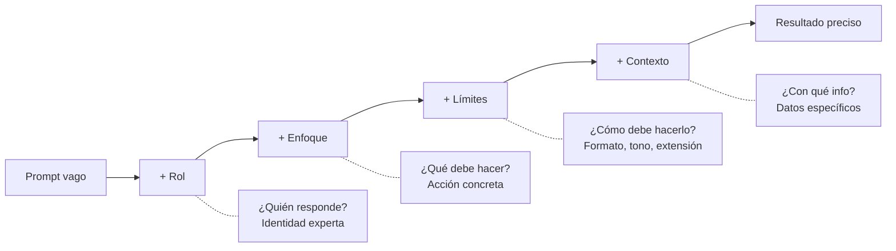
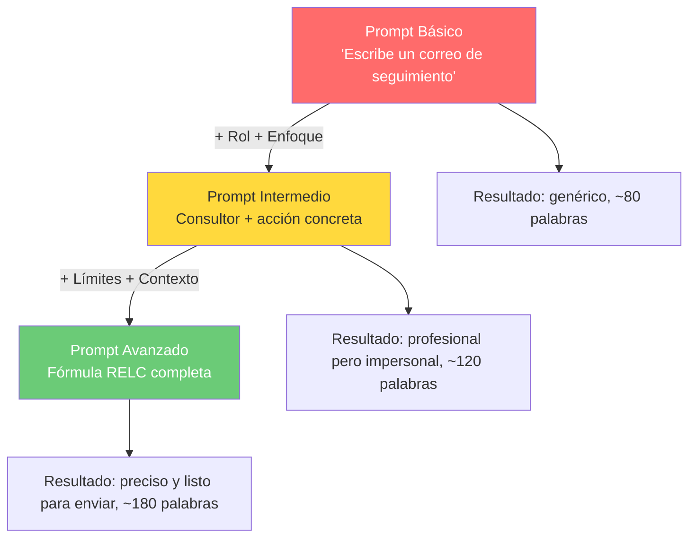

# Reto 12 — Prompt Engineering: De genérico a preciso

> Vibe Coders League Platzi 2026

Documentación del proceso de diseño de prompts progresivos aplicando técnicas de ingeniería de prompts: desde una instrucción vaga hasta una instrucción precisa y estructurada, con resultados comparables y análisis de cada técnica empleada.

**Estado:** Completado

---

## 1. El reto

El reto consiste en elegir un objetivo concreto y escribir **tres versiones de un prompt** — básico, intermedio y avanzado — para ese mismo objetivo. Por cada versión se muestra el resultado obtenido y se explican las técnicas aplicadas.

Las cinco técnicas que el reto pide demostrar son:

| # | Técnica | Descripción breve |
|---|---|---|
| 1 | **Contexto** | Proporcionar información específica que da sustancia al prompt |
| 2 | **Ejemplos** | Incluir muestras de entrada/salida esperada (few-shot) |
| 3 | **Formato** | Indicar la estructura de la respuesta (lista, tabla, párrafo, etc.) |
| 4 | **Rol** | Asignar una identidad experta al modelo |
| 5 | **Restricciones** | Definir límites de tono, extensión o contenido a evitar |

Cada versión del prompt incorpora técnicas adicionales respecto a la anterior, de modo que el lector puede observar cómo cada capa de instrucción mejora la calidad y utilidad de la respuesta.

---

## 2. La metodología

### La fórmula RELC

Para construir los prompts de forma sistemática se utiliza la fórmula **RELC**, que descompone cualquier prompt en cuatro componentes ortogonales:

```
Prompt = Rol + Enfoque + Límites + Contexto
```

Cada componente responde a una pregunta distinta y aporta un tipo diferente de precisión:

#### Rol
**¿Quién responde?** Da identidad experta al modelo.

Ejemplo: "Eres un especialista en marketing B2B con diez años de experiencia en SaaS."

Beneficios:
- Profesionalismo en el lenguaje y el enfoque
- Consistencia en criterios y perspectiva
- Mejor calibración del nivel de detalle técnico

#### Enfoque
**¿Qué debe hacer?** Define la acción concreta que se espera del modelo.

Ejemplo: "Redacta un correo de prospección en frío para un director de operaciones."

Consejo: usa verbos de acción precisos como crear, redactar, clasificar, resumir, comparar, evaluar.

#### Límites
**¿Cómo debe hacerlo?** Marcan el formato, el tono y la extensión de la respuesta.

Ejemplo: "Usa un tono profesional pero cercano. Máximo 150 palabras. Sin tecnicismos de ingeniería."

Efecto: claridad en la forma de entrega + precisión en el alcance de la respuesta.

#### Contexto
**¿Con qué información cuenta?** Da sustancia y referencia al prompt.

Ejemplo: "El producto es una plataforma de gestión de inventario. El prospecto trabaja en una empresa de distribución de 200 empleados que actualmente usa hojas de cálculo."

Efecto: evita respuestas genéricas al anclar al modelo a datos específicos y relevantes.

---

### Diagrama de la fórmula



---

### Mapeo: técnicas del reto vs. componentes RELC

Las cinco técnicas que el reto exige no son ajenas a RELC; la mayoría son instancias directas de sus componentes:

| Técnica del reto | Componente RELC | Notas |
|---|---|---|
| Rol | **Rol** | Directo — asignar identidad experta |
| Contexto | **Contexto** | Directo — proporcionar información específica |
| Formato | **Límites** | El formato es un tipo de límite (estructura, extensión) |
| Restricciones | **Límites** | Tono, extensión máxima, qué evitar |
| Ejemplos (few-shot) | Técnica complementaria | No forma parte de RELC, pero se aborda en Tips adicionales |

La única técnica que RELC no cubre de forma nativa es **los ejemplos** (few-shot prompting). Esta técnica actúa como un mecanismo de calibración adicional: en lugar de describir el resultado esperado, se muestra directamente. Se aborda en la sección de Tips adicionales.

---

## 4. El objetivo elegido

**Tarea:** redactar un correo profesional de seguimiento después de una reunión de negocios.

**Escenario:** Un consultor en transformación digital tuvo una reunión con Carlos Méndez, Director de Operaciones de ManufacturaPro, una empresa del sector manufacturero. Durante la reunión se discutió la digitalización de su línea de producción. Carlos mostró interés en una fase piloto de tres meses. El siguiente paso acordado es enviar una propuesta formal esta semana. La reunión tuvo lugar en las oficinas de ManufacturaPro y el ambiente fue positivo.

Este escenario es ideal para el ejercicio porque:

- Tiene nombres, cargos y empresa reales que el modelo puede aprovechar.
- Existe un siguiente paso concreto que debe reflejarse en el correo.
- El tono debe ser profesional pero cordial, lo que permite demostrar el efecto de las restricciones.
- Un prompt vago produce un correo inútil; un prompt preciso produce uno que se puede enviar sin edición.

---

## 5. Prompt Básico

### El prompt

```
Escribe un correo de seguimiento después de una reunión
```

### Resultado simulado

> Estimado/a,
>
> Me pongo en contacto para hacer seguimiento de nuestra reunión reciente. Fue un placer conversar con usted y explorar posibles áreas de colaboración.
>
> Quedo a su disposición para continuar avanzando en los temas que discutimos. Si tiene alguna pregunta o requiere información adicional, no dude en contactarme.
>
> Espero que podamos continuar con los próximos pasos en el futuro cercano.
>
> Saludos cordiales,
> [Nombre]

### Análisis

| Elemento | ¿Presente? | Detalle |
|----------|-----------|---------|
| Rol      | No        | No se asigna identidad experta |
| Enfoque  | Implícito | Solo dice "escribe un correo", sin definir tipo ni propósito |
| Límites  | No        | Sin restricciones de formato, tono ni extensión |
| Contexto | No        | Sin datos de la reunión, personas ni empresa |

### Veredicto

El resultado es genérico porque el modelo no tiene restricciones, no tiene identidad y no tiene información con la que trabajar. La salida es técnicamente correcta —es un correo de seguimiento— pero completamente inútil en la práctica: podría corresponder a cualquier reunión, con cualquier persona, en cualquier industria. No menciona a Carlos Méndez, no hace referencia a ManufacturaPro, no habla de digitalización ni de la fase piloto, y no propone ningún siguiente paso concreto. El modelo hizo lo que pudo con una instrucción vacía.

---

## 6. Prompt Intermedio

### El prompt

```
Eres un consultor de transformación digital. Redacta un correo de seguimiento
profesional después de una reunión con un potencial cliente empresarial.
El correo debe transmitir profesionalismo y mantener el interés del cliente.
```

### Resultado simulado

> Estimado/a,
>
> Me dirijo a usted para agradecer el tiempo que nos dedicó durante nuestra reunión y reafirmar el interés de nuestro equipo en acompañar a su organización en su proceso de transformación digital.
>
> Como consultor especializado en esta área, considero que los temas abordados representan una oportunidad concreta para mejorar la eficiencia operativa de su empresa. Estamos convencidos de que un enfoque estratégico y progresivo puede generar un impacto medible en el corto y mediano plazo.
>
> Quedo a su disposición para responder cualquier pregunta, ampliar la información compartida o coordinar una próxima reunión en el momento que sea conveniente para usted.
>
> Agradezco su confianza y espero que podamos avanzar juntos en esta dirección.
>
> Atentamente,
> [Nombre]
> Consultor de Transformación Digital

### Análisis

| Elemento | ¿Presente? | Detalle |
|----------|-----------|---------|
| Rol      | Sí        | Consultor de transformación digital |
| Enfoque  | Sí        | Redactar follow-up profesional para cliente empresarial |
| Límites  | No        | Sin restricciones de formato, tono específico ni extensión |
| Contexto | No        | Sin datos de la reunión, nombres ni detalles específicos |

### Veredicto

El rol le da al correo una voz profesional y consultiva que el prompt básico no tenía. El enfoque precisa la acción — queda claro que es un seguimiento empresarial y no cualquier tipo de correo. Sin embargo, sin límites, la estructura y extensión del correo son arbitrarias: el modelo decide solo cuánto escribir y en qué formato. Y sin contexto, el resultado sigue siendo impersonal — podría enviarse a cualquier cliente potencial en cualquier industria. La mejora respecto al prompt básico es real pero insuficiente para un correo listo para enviar.

---

## 7. Prompt Avanzado

### El prompt

```
[ROL]
Eres un consultor senior de transformación digital con 10 años de experiencia
en el sector manufacturero.

[ENFOQUE]
Redacta un correo de seguimiento después de una reunión de negocios con un
potencial cliente.

[LÍMITES]
- Máximo 200 palabras
- Tono profesional pero cercano
- Incluye un CTA (call to action) claro
- Estructura: saludo > agradecimiento > resumen de lo discutido > próximos pasos > cierre
- No uses jerga técnica excesiva

[CONTEXTO]
- Reunión con Carlos Méndez, Director de Operaciones de ManufacturaPro
- Se discutió la digitalización de su línea de producción
- Mostró interés en una fase piloto de 3 meses
- El próximo paso es enviar una propuesta formal esta semana
- La reunión fue en las oficinas de ManufacturaPro y el ambiente fue positivo
```

### Resultado simulado

> Estimado Carlos,
>
> Quiero agradecerte el tiempo que nos dedicaste ayer en las oficinas de ManufacturaPro. Fue una conversación muy enriquecedora y salí con la convicción de que hay una oportunidad real para transformar tu operación.
>
> Como comentamos, la digitalización de tu línea de producción tiene un potencial claro para reducir tiempos de respuesta y aumentar la visibilidad operativa. Me alegró mucho escuchar tu apertura hacia una fase piloto de 3 meses: es exactamente el enfoque que recomiendo para validar resultados antes de escalar.
>
> Para mantener el impulso de la reunión, te enviaré la propuesta formal el miércoles. En ella detallaré el alcance del piloto, los entregables por etapa y una estimación de los beneficios esperados.
>
> Quedo atento a cualquier pregunta que surja antes de entonces.
>
> Un cordial saludo,
> Alejandro Ríos
> Consultor Senior de Transformación Digital

### Análisis

| Elemento | ¿Presente? | Detalle |
|----------|-----------|---------|
| Rol      | Sí        | Consultor senior, 10 años de experiencia, sector manufacturero |
| Enfoque  | Sí        | Correo de follow-up post-reunión con cliente potencial |
| Límites  | Sí        | 200 palabras máx., tono cercano, CTA, estructura definida, sin jerga |
| Contexto | Sí        | Carlos Méndez, ManufacturaPro, digitalización, piloto 3 meses, propuesta |

### Veredicto

Con los cuatro componentes RELC presentes, el modelo produce un correo listo para enviar. Cada elemento contribuyó de forma distinta:
- **Rol** aportó experiencia y calibró el tono al sector manufacturero
- **Enfoque** definió con exactitud qué tipo de correo redactar
- **Límites** moldearon el formato, la extensión y la estructura de la respuesta
- **Contexto** proporcionó la sustancia que hace el correo personal y accionable

El salto de intermedio a avanzado es mayor que el de básico a intermedio: el contexto es el diferenciador más poderoso. Sin él, el rol y el enfoque producen un texto profesional pero impersonal. Con él, el correo nombra a Carlos, menciona ManufacturaPro, referencia la digitalización de la línea de producción, propone el piloto de tres meses y establece un CTA concreto con fecha. Esa especificidad es lo que convierte un borrador genérico en una comunicación real.

---

## 8. Comparativa general

| Nivel | Rol | Enfoque | Límites | Contexto | Calidad del resultado |
|-------|-----|---------|---------|----------|-----------------------|
| Básico | -- | Implícito | -- | -- | Genérico, no utilizable tal cual |
| Intermedio | Consultor de transformación digital | Follow-up profesional para cliente | -- | -- | Profesional pero impersonal |
| Avanzado | Consultor senior, 10 años, sector manufacturero | Follow-up post-reunión con cliente potencial | 200 palabras, tono cercano, CTA, estructura, sin jerga | Carlos Méndez, ManufacturaPro, digitalización, piloto 3 meses | Preciso, personalizado, listo para enviar |

Cada fila de la tabla muestra cómo la incorporación progresiva de los componentes RELC transforma la calidad del resultado. El prompt básico produce algo técnicamente correcto pero inútil en la práctica: es un correo que podría haber escrito cualquier persona para cualquier reunión. La versión intermedia gana voz profesional gracias al rol y al enfoque, pero sigue siendo impersonal porque no tiene información con qué trabajar. La versión avanzada, con los cuatro componentes presentes, se convierte en un correo real y accionable: tiene destinatario, tema, tono, estructura y un siguiente paso concreto.

---

## 9. Diagrama de evolución



El diagrama muestra la progresión de los tres niveles de prompt a lo largo del eje de calidad. La secuencia de colores —rojo, amarillo, verde— representa la mejora en la utilidad del resultado: de un correo genérico e inutilizable a uno listo para enviar sin edición. Cada flecha indica qué componentes RELC se agregaron en ese paso: la primera flecha suma Rol y Enfoque, lo que eleva el tono pero no elimina la impersonalidad; la segunda flecha suma Límites y Contexto, lo que ancla el correo a una situación real y le da forma, extensión y dirección concretas.

---

## 10. Tips adicionales

### 1. Divide problemas complejos en pasos

Si necesitas múltiples salidas —un correo, una propuesta y una presentación—, escribe un prompt específico para cada paso en lugar de un mega-prompt que lo intente todo a la vez. Cada sub-tarea recibe su propio prompt enfocado con el nivel de RELC adecuado para esa acción concreta. Esto reduce alucinaciones y mantiene los resultados manejables.

### 2. Creatividad vs. precisión

Para tareas creativas —brainstorming, copywriting, ideación—, da más libertad: menos Límites, Enfoque más abierto. Para tareas precisas —correos, documentos legales, código—, añade más límites: formato específico, tono definido, extensión máxima. El balance depende de la tarea, no de una receta fija.

### 3. Elige modelo y enfoque según la tarea

Distintas tareas se benefician de distintas configuraciones. La síntesis necesita precisión (más Límites). El brainstorming necesita creatividad (más libertad). La clasificación necesita ejemplos (few-shot). Adapta el enfoque al tipo de tarea, no al revés.

### 4. Ejemplos (few-shot prompting)

Cuándo incluir ejemplos en el prompt: para tareas de clasificación, formateo o imitación de estilo, proporcionar dos o tres ejemplos de entrada y salida es extremadamente poderoso. En el escenario del correo, el contexto específico fue más valioso que ejemplos genéricos de correos, pero para una tarea como "clasifica quejas de clientes en categorías", los ejemplos few-shot serían indispensables.

---

## 11. Conclusiones

### La fórmula reduce ambigüedad progresivamente

Cada elemento de RELC elimina una categoría de respuestas genéricas. El Rol elimina la incertidumbre de tono. El Enfoque elimina la ambigüedad de tarea. Los Límites eliminan las suposiciones de formato. El Contexto elimina la vaguedad de contenido. El resultado: menos espacio para que el modelo recurra a patrones genéricos.

### Cada elemento tiene un rol específico

El Rol establece la experiencia y calibra el lenguaje. El Enfoque define qué hacer. Los Límites dan forma a la salida. El Contexto aporta la sustancia. Ningún elemento es redundante: eliminar cualquiera degrada el resultado de forma predecible.

### El contexto es el mayor diferenciador

El salto de intermedio a avanzado fue la mejora más grande. El Rol y el Enfoque ayudan, pero es el contexto lo que transforma una plantilla genérica en un resultado utilizable y personalizado. Cuando haya dudas, añade más contexto.

---

Un buen prompt no es largo por ser largo — es preciso porque cada palabra cumple una función.
